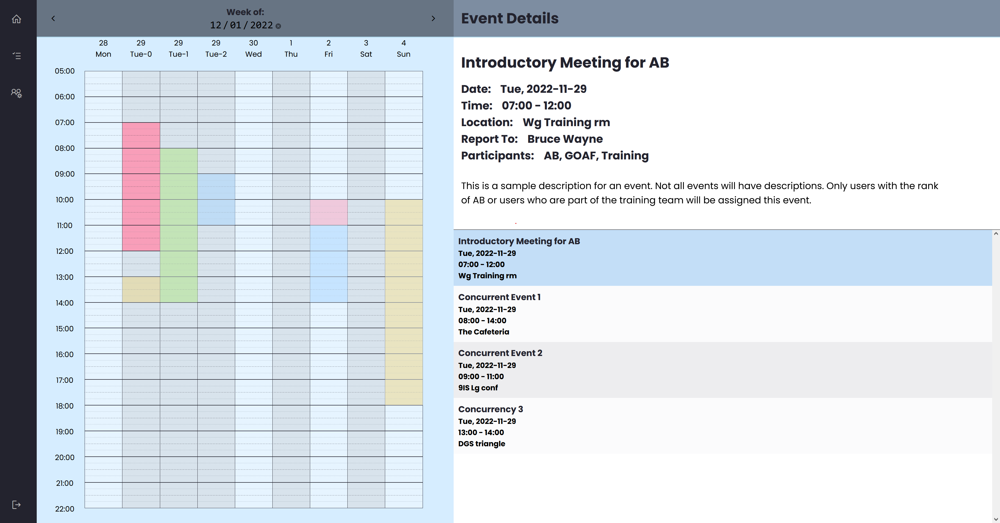

# TaskTracker222
### Team Name: rm rf root

## Team Members and Contact Info 
Amrin Sandhar, amrinsandhar@csus.edu, (916) 996-7359  
Anish Gautam, agautam@csus.edu, (530) 383-3267  
Noel Paulite, npaulite@csus.edu, (510) 509-5739  
Michelle Chan, mchan@csus.edu, (916) 896-4096  
Visoth Cheam, vcheam@csus.edu, (916) 547-6256  
Tobechi Maduchukwu, tmaduchukwu@csus.edu, (916) 533-4601  
Brian Frey, brianfrey@csus.edu, (916) 705-2987  
Marouf Zaman, maroufzaman@csus.edu, (209) 420-4595  

## Project Synopsis
Task Tracker 222 has the following features:
* A drill schedule recipient view in which users can view drills they have been listed as participants in
* A drill manager that allows administrators to create, edit, and delete drills that are assigned to users
* A user manager that allows administrators to approve/deny new accounts, edit existing accounts, and delete accounts.

## Client Logo

## User Interface

- See details on use in the [User Manual](documents/TT222_User_Manual.pdf)

## Deployment
- Set up environment variables as described in the [Maintenance Manual](documents/TT222_Maintenance_Manual.pdf) document
- Use command **"mvn clean install"** to build single-source executable
- Run single source executable with **"java -jar <filename>.jar"**

## Testing
- Unit tests with JUnit5 framework
  - Used to test each class in isolation
  - Tests for services and controllers are integrated with Mockito to mock dependencies and components
- Integration testing implemented with Postman
  - Used to test overall behavior of the API by verifying each endpoint with HTTP requests generated by Postman
  - Authenticated requests rely on OAuth 2.0, containing the id-token from the Amazon Cognito user pool
- Manual testing by hand (see the [System Test Report](documents/TT222_System_Test_Report.pdf) for further details)

## ERD

